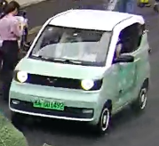
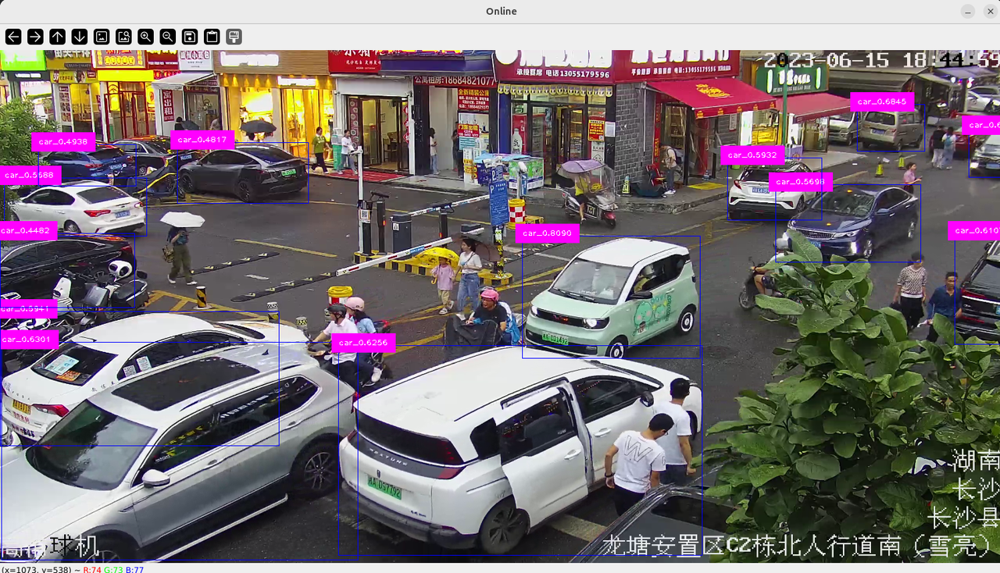
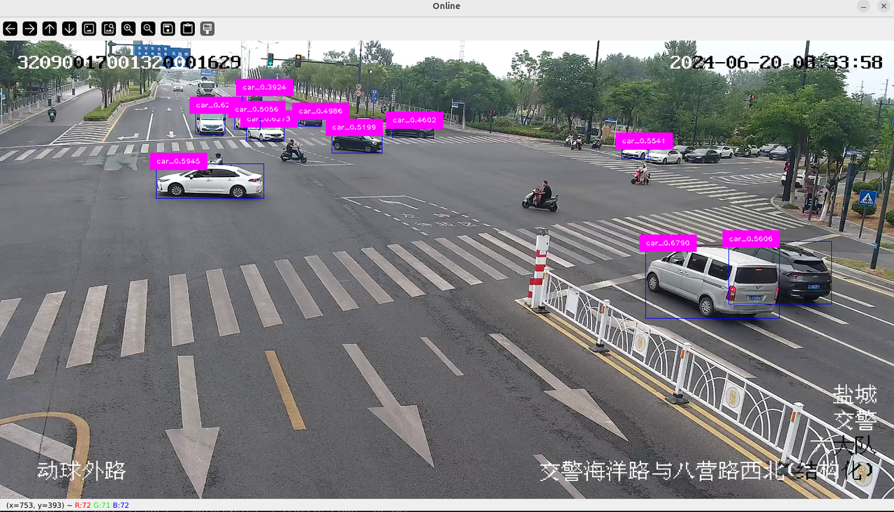
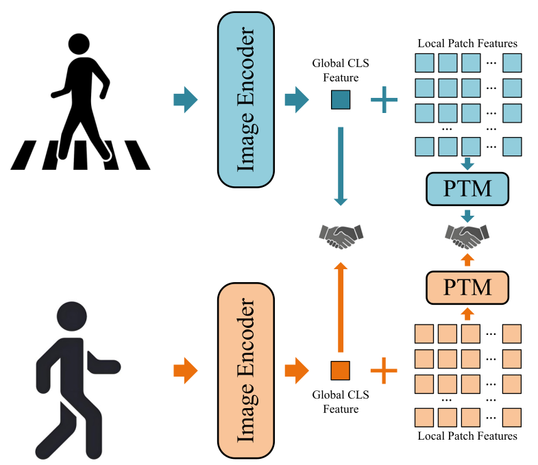
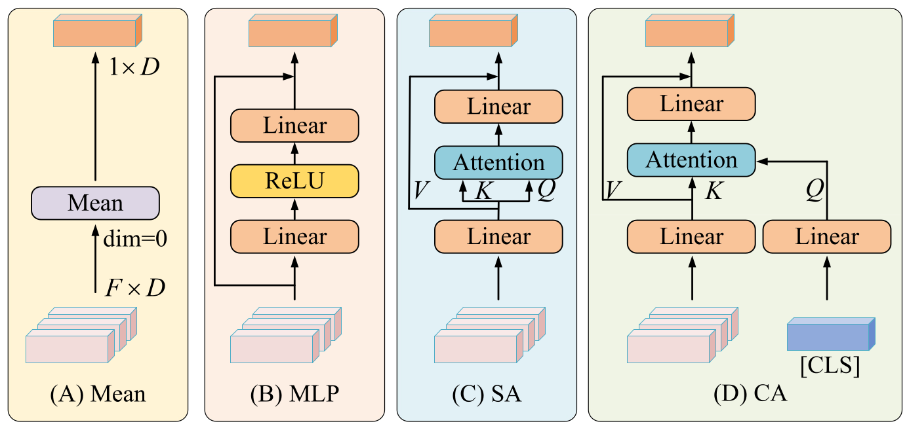

<div align="left">

# [Project] Person and Car Re-Identification (ReID)
</div>

## 🎯 Project Introduction

1. 👥 This project implements **person** and **vehicle** Re-Identification (ReID) tasks, supporting training, testing, and online inference workflows.  
2. 📂 The project structure includes **dataset processing scripts**, **model code**, a directory for **pre-trained models**, and **evaluation tools**.  
3. ⚙️ It provides a complete usage pipeline, including **environment setup**, **data preparation** (for both person and car datasets), as well as **training** and **testing scripts**.  
4. 📊 The person ReID datasets include multiple standard benchmarks such as **CUHK**, **Market-1501**, **ICFG-PEDES**, and **RSTP-Reid**.  
5. 🚗 It also supports **vehicle ReID datasets** collected from real-road videos, covering **object extraction**, **data cleaning**, and **dataset splitting**.  

## 📣 Updates
* **[2025, 08]**: We have released the complete ReID training and testing code.

## 🚀 Quick Start
### Setup

#### Download files
```shell
git clone https://github.com/OPA067/ReID
cd ReID
```

#### Setup code environment
```shell
conda create -n ReID python=3.12
conda activate ReID
pip install -r requirements.txt
pip install torch==1.8.1+cu102 torchvision==0.9.1+cu102 -f https://download.pytorch.org/whl/torch_stable.html
```

#### Prepare person and car datasets
- 📂 reid_datasets
  - person_images
    - cam_a     
    - cam_b
    - CUHK01
    - CUHK03
    - Market
    - ICFG-PEDES-train
    - ICFG-PEDES=test
    - train_query
    - test_query
    - RSTP-Reid
  - person_jsons
    - test_query.json
      - {"id": 0, "tar_path": "test_query/p3810/p3810_s4782.jpg", "can_path": "test_query/p3810/p3810_s4781.jpg"},
      - {"id": 1, "tar_path": "test_query/p7463/p7463_s9933.jpg", "can_path": "test_query/p7463/p7463_s9932.jpg"},
      - ...
    - train_cam_a_b.json
    - train_CUKH01.json
    - ...

where cam_a, cam_b, CUHK01, CUHK03, Market, train_query and test_query from [CUHK-PEDES](https://openaccess.thecvf.com/content_cvpr_2017/html/Li_Person_Search_With_CVPR_2017_paper.html), 
RSTP-Reid from [RSTP-Reid](http://arxiv.org/abs/2109.05534), and ICFG-PEDES-train and ICFG-PEDES-test from [ICFG-PEDES](https://arxiv.org/abs/2107.12666), where .json stores the relative path of the image, 
e.g., "cam_a/010_0.bmp", and create `.json` details via:
```bash
python ./reid_datasets/create_person_reid_json.py and ./reid_datasets/create_car_reid_json.py
```
We collect real-road videos for object extraction, data cleaning, and train-test splitting, rather than using public datasets. The directory structure is as follows:
- 📂 reid_datasets
  - car_images
    - train_video_1
    - train_video_2
    - train_video_3
    - ...
    - test_video_1
    - test_video_2
    - test_video_3
    - ...
  - car_jsons
    - train_video_1.json
    - ...
    - test_video_1.json
    - ...
    - 
where data organization is identical to that of the *person* dataset, and note that `train_video_1` and `test_video_1` do not represent the same video.

#### Download Pretrain Models

<div align="center">

|  Models  |                                                              Download Link                                                              |             Functions              |                                         Features                                         |
|:--------:|:---------------------------------------------------------------------------------------------------------------------------------------:|:----------------------------------:|:----------------------------------------------------------------------------------------:|
| coco.txt |                                         [Download](https://docs.ultralytics.com/models/yolov8/)                                         |        For coco class_list         |                                            -                                             |
| yolov8l  |                                         [Download](https://docs.ultralytics.com/models/yolov8/)                                         |       For target extraction        |                                            -                                             |
| yolov11  |                                         [Download](https://docs.ultralytics.com/models/yolo11/)                                         |        For target tracking         |                                            -                                             |
|   RN50   |   [Download](https://openaipublic.azureedge.net/clip/models/afeb0e10f9e5a86da6080e35cf09123aca3b358a0c3e3b6c78a7b63bc04b6762/RN50.pt)   | For lightweight feature extraction |                         `[CLS]`, $I \in \mathcal{R}^{1 \times D}$                          |
|  RN101   |  [Download](https://openaipublic.azureedge.net/clip/models/8fa8567bab74a42d41c5915025a8e4538c3bdbe8804a470a72f30b0d94fab599/RN101.pt)   | For lightweight feature extraction |                         `[CLS]`, $I \in \mathcal{R}^{1 \times D}$                          |
|  RN50x4  |  [Download](https://openaipublic.azureedge.net/clip/models/7e526bd135e493cef0776de27d5f42653e6b4c8bf9e0f653bb11773263205fdd/RN50x4.pt)  |  For intensive feature extraction  |                         `[CLS]`, $I \in \mathcal{R}^{1 \times D}$                          |
| RN50x64  | [Download](https://openaipublic.azureedge.net/clip/models/be1cfb55d75a9666199fb2206c106743da0f6468c9d327f3e0d0a543a9919d9c/RN50x64.pt)  |  For intensive feature extraction  |                         `[CLS]`, $I \in \mathcal{R}^{1 \times D}$                          |       
| ViT-B/32 | [Download](https://openaipublic.azureedge.net/clip/models/40d365715913c9da98579312b702a82c18be219cc2a73407c4526f58eba950af/ViT-B-32.pt) |  For intensive feature extraction  | `[CLS]` and `[Patch]`, $I \in \mathcal{R}^{1 \times D}$ and $P \in \mathcal{R}^{N \times D}$ |
| ViT-B/16 | [Download](https://openaipublic.azureedge.net/clip/models/5806e77cd80f8b59890b7e101eabd078d9fb84e6937f9e85e4ecb61988df416f/ViT-B-16.pt) |  For intensive feature extraction  | `[CLS]` and `[Patch]`, $I \in \mathcal{R}^{1 \times D}$ and $P \in \mathcal{R}^{N \times D}$ |
| ViT-L/14 | [Download](https://openaipublic.azureedge.net/clip/models/b8cca3fd41ae0c99ba7e8951adf17d267cdb84cd88be6f7c2e0eca1737a03836/ViT-L-14.pt) |  For intensive feature extraction  | `[CLS]` and `[Patch]`, $I \in \mathcal{R}^{1 \times D}$ and $P \in \mathcal{R}^{N \times D}$ |
</div>

The above models are stored as needed in the `./pretrain_models` directory.

#### Train ReID model
```shell
#!/bin/bash
root_dir={YOUR WORDING ROOT DIR}
DATASET_NAME=RSTP-Reid
CUDA_VISIBLE_DEVICES=0 \
    python retrieval_train.py \
    --name RDE \
    --img_aug \
    --txt_aug \
    --batch_size 32 \
    --root_dir $root_dir \
    --output_dir experiments \
    --dataset_name $DATASET_NAME \
    --loss_names ReID  \
    --pretrain_choice {PRETRAIN MODEL} \
    --log_period 100 \
    --num_epoch 20
```
or you can run:
```shell
bash reid_train.sh
```

#### Test ReID model
```shell
python reid_test.py
```

## ✨ Vision
To enable real-time visualization of the retrieval process without pre-storing all candidate images, we integrate the detection and retrieval processes, directly showing how the target image matches with all candidate images, as illustrated below:
```shell
python reid_online.py
```
<p align="center">
  
  
  
</p>

## 💪 Feature Enhancement
<p align="center">
  
  
</p>

Feature enhancement includes single-feature re-representation and multi-feature aggregation. 
Single-feature re-representation involves remapping the `[CLS]` token using methods such as `MLP` or `Transformer`, 
while multi-feature aggregation aggregates `[Patch]` tokens through learnable modules like `MHA` or `Cluster`. For these two types of feature enhancement schemes, the following feature alignment methods are proposed:

#### 1.zero-shot `[CLS]`
$S=sim({I}_1, {I}_2) = \frac{{I}_1 \cdot {I}_2}{||{I}_1||_2 \cdot ||{I}_2||_2}$
```python
# update model/clip_model.py
def forward(self, tar_images, can_images):
    with torch.no_grad():
        tar_feats = self.encode_image(tar_images)
        can_feats = self.encode_image(can_images)
```
where $I$=`[CLS]`$\in \mathcal{R}^{1 \times D}$.

#### 2.fine-tuning `[CLS]`
$S=sim({I}_1, {I}_2) = \frac{{I}_1 \cdot {I}_2}{||{I}_1||_2 \cdot ||{I}_2||_2}$
```python
# update model/clip_model.py
def forward(self, tar_images, can_images):
    tar_feats = self.encode_image(tar_images)
    can_feats = self.encode_image(can_images)
```

#### 3.zero-shot `[CLS]` + `[Patch]`
$S = \frac{1}{2} \left( sim({I}_1, {I}_2) + sim({P}_1, {P}_2) \right ) = \frac{1}{2} \left( \frac{{I}_1 \cdot {I}_2}{||{I}_1||_2 \cdot ||{I}_2||_2} + \frac{{P}_1 \cdot {P}_2}{||{P}_1||_2 \cdot ||{P}_2||_2} \right)$, \
where $I$=`[CLS]`$\in \mathcal{R}^{1 \times D}$ and $P$=`[Patch]`$=\frac{1}{N}\sum_i^N P_i\in \mathcal{R}^{1 \times D}$.

#### 4.fine-tuning `[CLS]` + `[Patch]`
$S = \frac{1}{2} \left( sim({I}_1, {I}_2) + sim({P}_1, {P}_2) \right ) = \frac{1}{2} \left( \frac{{I}_1 \cdot {I}_2}{||{I}_1||_2 \cdot ||{I}_2||_2} + \frac{{P}_1 \cdot {P}_2}{||{P}_1||_2 \cdot ||{P}_2||_2} \right)$, \
where $I$=`[CLS]`$\in \mathcal{R}^{1 \times D}$ and $P$=`[Patch]`$=Model(P) \in \mathcal{R}^{1 \times D}$. $Model$ can use [MLP](https://github.com/OPA067/ReID/model/mlp.py), [MHA](https://github.com/OPA067/ReID/model/mha.py), or [PTM](https://github.com/OPA067/ReID/model/cluster.py).

## 📄 Experiment Reports
[行人再识别P2P技术报告1(初版)](https://allcaminfo.feishu.cn/docx/Hg6TdLKwhoALB5xN0v1ct3HlnHd) update 2025, 04. \
[行人再识别P2P技术报告2(优化)](https://allcaminfo.feishu.cn/docx/XqtjdJ3VaoYSWmxdPodc78grnLc) update 2025, 04. \
[行人再识别P2P技术报告3(补充)](https://allcaminfo.feishu.cn/docx/UNYqdpetdoUiC0xImABc9dmrnDg) update 2025, 05. \
[PTM of ReID: Patch Token Merge](https://allcaminfo.feishu.cn/docx/K9hndKwqvoLUrDxwhSgcU7fZnoq) update 2025, 05. \
[行人检索完整方案](https://allcaminfo.feishu.cn/docx/P06dd1d7BozGcdxSDP6cwDx4n6c) update 2025, 06. \
[车辆再检索研究报告](https://allcaminfo.feishu.cn/docx/V2abd3n0foQxgNxlRKwcaqnWndh) update 2025, 07. \
[万物再检索研究报告](https://allcaminfo.feishu.cn/docx/NIPzdrmHBoiIvuxuA03cu8fWnvc) update 2025, 07. \
[轻量型密集型特征提取器实验报告](https://allcaminfo.feishu.cn/docx/KvcxdtCOuoLadIxlCkZcNQvJn7f) update 2025, 08.

## 📌 Hint
For more details, please contact [223081200014@smail.swufe.edu.cn](mailto:23081200014@smail.swufe.edu.cn)

## 🎗️ Acknowledgments
Our code is based on [CVPR2024RDE](https://github.com/QinYang79/RDE), [CVPR2024HBI](https://github.com/jpthu17/HBI/tree/main). We sincerely appreciate for their contributions.
